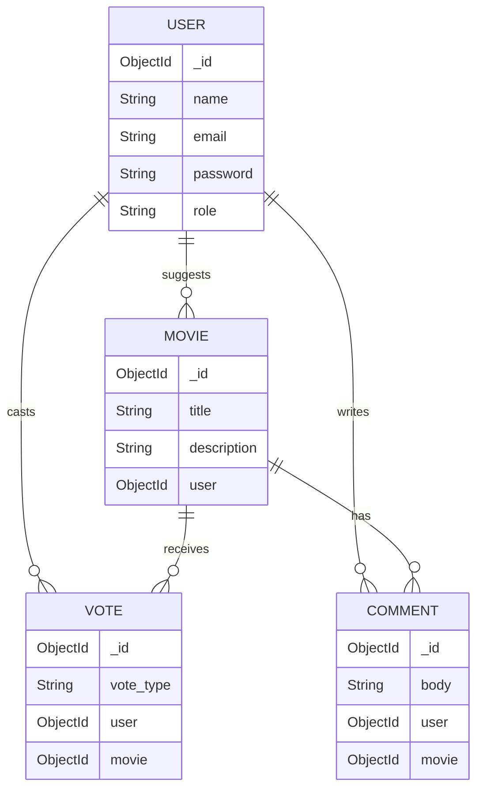

# MovieHub - MERN Movie Recommendation Board


A full-stack web application where users can suggest, vote on, and discuss their favorite movies. Built with the MERN stack (MongoDB, Express, React, Node.js).

**Live Deployment Link:** [**Your Live URL Will Go Here**](https://your-moviehub-frontend.onrender.com)

---

## Features

-   **User Authentication:** Secure signup and login functionality using JWT.
-   **Suggest Movies:** Authenticated users can recommend new movies with a title and description.
-   **Vote on Movies:** Users can upvote or downvote any movie recommendation (one vote per user per movie).
-   **Dynamic Ranking:** The main page displays a list of all movies, automatically sorted by their score (upvotes - downvotes).
-   **Admin Moderation:** Users with an 'ADMIN' role can delete any movie or comment from the platform.
-   **Clean, Modern UI:** A responsive and intuitive user interface built with React and CSS Modules.

---

## Tech Stack

-   **Frontend:** React (with Vite), React Router, Axios, CSS Modules.
-   **Backend:** Node.js, Express.js.
-   **Database:** MongoDB (with MongoDB Atlas for hosting).
-   **ODM:** Mongoose for elegant data modeling and validation.
-   **Authentication:** JSON Web Tokens (JWT) & bcryptjs for password hashing.

---

## Database Schema

This diagram illustrates the relationships between the collections in the MongoDB database. A user can suggest many movies, and each movie can have many votes and comments from various users.



---

## API Endpoints

| Method   | Path                          | Description                  | Auth      |
| :------- | :---------------------------- | :--------------------------- | :-------- |
| `POST`   | `/api/auth/register`          | Register a new user.         | Public    |
| `POST`   | `/api/auth/login`             | Login and receive a JWT.     | Public    |
| `GET`    | `/api/movies`                 | Get all movies, ranked.      | Public    |
| `POST`   | `/api/movies`                 | Suggest a new movie.         | **User**  |
| `POST`   | `/api/movies/:id/vote`        | Upvote or downvote a movie.  | **User**  |
| `DELETE` | `/api/movies/:id`             | Delete a movie.              | **Admin** |
| `DELETE` | `/api/comments/:id`           | Delete a comment.            | **Admin** |

---

## Local Setup Instructions

**Prerequisites:**
*   Node.js (v18 or later)
*   npm
*   A free [MongoDB Atlas](https://www.mongodb.com/cloud/atlas) account

### 1. Clone the Repository

```bash
git clone https://github.com/your-username/moviehub-mern.git
cd moviehub-mern
```

### 2. Backend Setup

```bash
# Navigate to the server directory
cd server

# Install dependencies
npm install

# Create a .env file in the /server directory
touch .env
```

Add the following environment variables to your `server/.env` file. Get the `MONGO_URI` from your MongoDB Atlas dashboard.

```env
# /server/.env

MONGO_URI="mongodb+srv://<username>:<password>@cluster0.xxxxx.mongodb.net/moviehub?retryWrites=true&w=majority"
JWT_SECRET="a_very_strong_and_long_random_secret_string"
```

### 3. Seed the Database

To populate the database with a sample admin and user, run the seed script.

```bash
# From the /server directory
npm run seed
```

### 4. Frontend Setup

```bash
# Navigate to the client directory from the root
cd ../client

# Install dependencies
npm install

# Create a .env file in the /client directory
touch .env
```

Add the following environment variable to your `client/.env` file. This tells your React app where to find the backend API.

```env
# /client/.env

VITE_API_URL=http://localhost:5001
```

### 5. Run the Application

You will need two separate terminals to run both the backend and frontend servers simultaneously.

**In your first terminal (from `/server`):**

```bash
npm start
```

**In your second terminal (from `/client`):**

```bash
npm run dev
```

The application should now be running at `http://localhost:5173` (or the port specified by Vite).

**Admin Credentials (from seed script):**
-   **Email:** `admin@moviehub.com`
-   **Password:** `adminpass`

---

## AI Usage

This project was developed with the assistance of an AI programming assistant. Here is a summary of how it was used:

*   **Where was it used?**
    *   To generate boilerplate code for the Express.js server, Mongoose schemas, and React components.
    *   To create the professional, modern UI with CSS Modules, including the layout for `MovieCard` and form styling.
    *   To debug runtime errors, such as the `ERR_CONNECTION_REFUSED` network error and the `dotenv` path issue in the seed script.
    *   To write the MongoDB aggregation query for calculating movie scores efficiently on the backend.
    *   To generate this `README.md` file with clear instructions and a schema diagram.

*   **Why was it helpful?**
    *   The AI significantly accelerated the development process by handling repetitive setup tasks, allowing me to focus on the core application logic and data flow.
    *   It provided immediate, context-aware solutions to bugs that could have taken much longer to solve manually.
    *   It demonstrated best practices, such as using CSS Modules for scoped styling and creating a robust server-side aggregation pipeline for data processing.

*   **What did you learn?**
    *   I learned a more efficient way to calculate derived data (like a "score") directly within a MongoDB query using the Aggregation Framework, which is far better for performance than calculating it on the client-side.
    *   I gained a clearer understanding of how `dotenv` resolves paths and the importance of ensuring environment variables are loaded correctly in different script contexts (e.g., server vs. seed script).
    *   I learned how to structure a professional React project with a clean separation of concerns (components, pages, services, context).